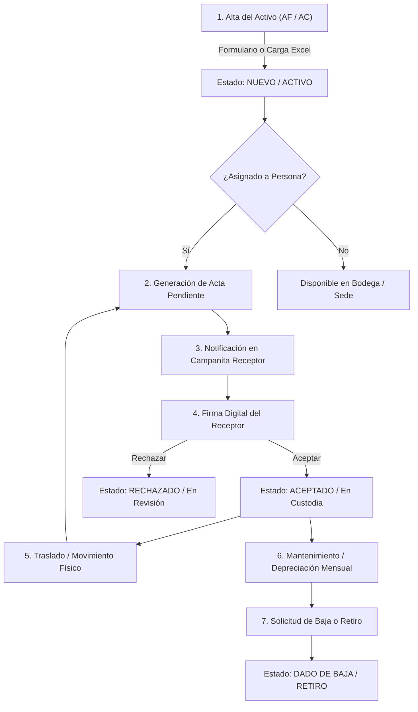
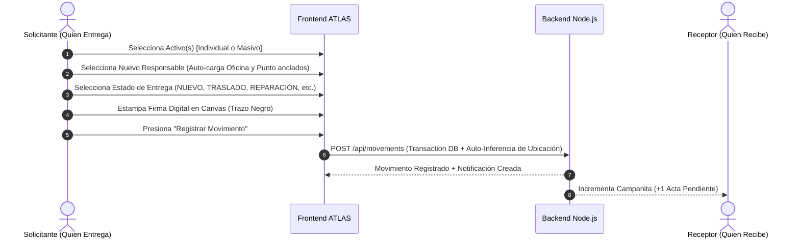

# 📘 Manual y Flujos de Usuario del Sistema ATLAS

> [!NOTE]
> Este documento describe en detalle todos los flujos de trabajo del **Sistema de Control de Activos ATLAS**, desde el alta e importación inicial de activos hasta su baja o retiro definitivo, incluyendo la firma digital de actas y la seguridad por roles.

---

## 👥 1. Matriz de Permisos por Rol

| Módulo / Acción | Administrador (`ADMIN`) | Operador / Funcionario (`OPERATOR` / `VIEWER`) |
| :--- | :---: | :---: |
| **Visibilidad de Inventario** | 🌐 **Global** (Todos los activos) | 🔒 **Restringido** (Solo activos propios asignados) |
| **Creación de Activos (AF/AC)** | ✅ Individual y Masiva (Excel) | ❌ No disponible |
| **Traslado / Movimientos** | ✅ Cualquier activo del sistema | 🔒 Únicamente sus activos asignados |
| **Previsualización & Firma FR-GA-57** | ✅ Firma de entregante y receptor | ✅ Firma de sus traslados |
| **Descarga Excel con Filtros** | ✅ Exporta datos globales o filtrados | 🔒 Exporta únicamente sus activos filtrados |
| **Dada de Baja / Retiro** | ✅ Autorización y ejecución | ❌ Solicitud previa requerida |

---

## 🔄 2. Diagrama del Ciclo de Vida del Activo

---

## 📋 3. Flujos Detallados Paso a Paso

### 🚀 Flujo A: Creación e Importación de Activos
1. **Ingreso:** El Administrador accede a **Inventario** y presiona **`+ Agregar Activo`**.
2. **Modalidad Individual:**
   - Ingresa Nombre, Valor Inicial, Categoría, Marca, Código Contable, Proveedor y Ubicación.
   - Selecciona la **Clasificación**: `Activo Fijo (AF)` (depreciable) o `Activo de Control (AC)` (accesorios/consumibles).
   - Opcionalmente sube la foto del activo y el PDF de la factura/OC a MinIO.
3. **Modalidad Masiva (Excel):**
   - Selecciona el archivo `.xlsx` estructurado (basado en `/home/Plantilla_Carga_Datos_Atlas.xlsx`).
   - El sistema valida catálogos y procesa la carga en lote en una transacción atómica.

---

### 🔄 Flujo B: Registrar Traslado / Movimiento de Activos

> [!TIP]
> **Autocompletado de Ubicación por Usuario:** Al seleccionar el **Nuevo Responsable**, el sistema detecta automáticamente la oficina y el punto de venta a los que está anclado ese usuario y los carga de forma inmediata sin necesidad de ingresar toda la información manualmente.

---

### ✍️ Flujo C: Aceptación Digital (Individual y Masiva)

1. **Notificación:** El funcionario receptor ve la campanita de notificaciones iluminada con **Aceptaciones Pendientes** (+N).
2. **Modalidad Individual:**
   - Al pulsar una notificación o ícono individual, accede al modal **Firma Digital: FR-GA-57**.
   - Revisa el activo asignado, ubicación y observaciones.
   - Introduce Cédula, Cargo y dibuja su **Firma Digital** en el lienzo (trazo negro con respuesta 1:1 al cursor).
   - El sistema pasa el activo a `ACEPTADO`, genera el PDF oficial FR-GA-57 e incrementa la trazabilidad auditada.

3. **Modalidad Masiva (Aceptación Masiva):**
   - **Selección de Activos:** En la pestaña **Aceptaciones Pendientes**, el usuario marca múltiples casillas de verificación (checkboxes).
   - **Regla Estricta de Validez Legal:** El sistema valida automáticamente que **todos los activos seleccionados provengan del MISMO usuario entregante (`cedula_origen` / `sender_name`)**.
   - **Bloqueo por Múltiples Entregantes:** Si el usuario selecciona activos de distintos entregantes, la barra de acciones masivas muestra un mensaje de advertencia y deshabilita la firma conjunta para evitar alterar la validez legal de las firmas de origen.
   - **Firma Masiva:** Una vez validado que provienen del mismo entregante, se abre la previsualización masiva del formato **FR-GA-57**, consolidando los activos en el acta. El receptor firma una única vez y el backend actualiza atómicamente todo el lote en la base de datos y guarda el PDF masivo en MinIO.

---

### 📉 Flujo D: Proceso de Dada de Baja / Retiro de Activos

1. **Identificación:** Un activo alcanza el final de su vida útil, sufre obsolescencia técnica o daño irreparable.
2. **Registro de Movimiento de Retiro:**
   - En el módulo de **Movimientos**, se selecciona el Estado de Entrega: `RETIRO` o `BAJA`.
   - Se especifica el motivo detallado (Ej: "Daño irreparable en tarjeta madre / Siniestro").
3. **Actualización de Estado:**
   - El activo pasa a condición `DADO DE BAJA`.
   - Se detiene el cálculo de depreciación mensual, preservando el valor en libros acumulado hasta la fecha.
   - El historial de custodias y actas previas permanecen auditables en el sistema.

---

### 📊 Flujo E: Exportación a Excel con Filtros Activos de Pantalla

> [!TIP]
> Al presionar el botón **`Descargar Excel`** en la pantalla de Inventario, el reporte resultante respetará cualquier filtro activo (Búsqueda textual, Categoría, Estado físico, Cédula o Clasificación AF/AC) o selección con checkbox realizada previamente.

1. El usuario (Administrador o Funcionario) aplica filtros en la tabla de Inventario.
2. Al pulsar **`Descargar Excel`**:
   - Si seleccionó filas específicas con el checkbox, se exportan únicamente las seleccionadas.
   - Si no hay filas marcadas pero hay filtros en pantalla, **el sistema exporta exactamente los activos filtrados**.
   - Si el usuario no es Administrador, el reporte se limita automáticamente a sus activos asignados.
